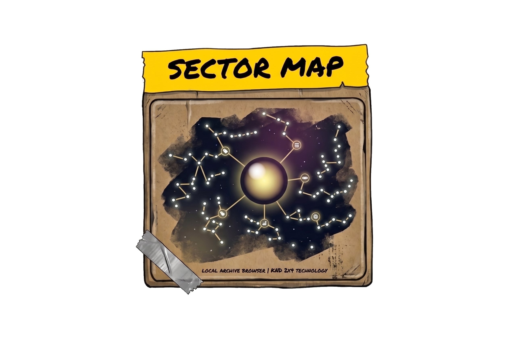
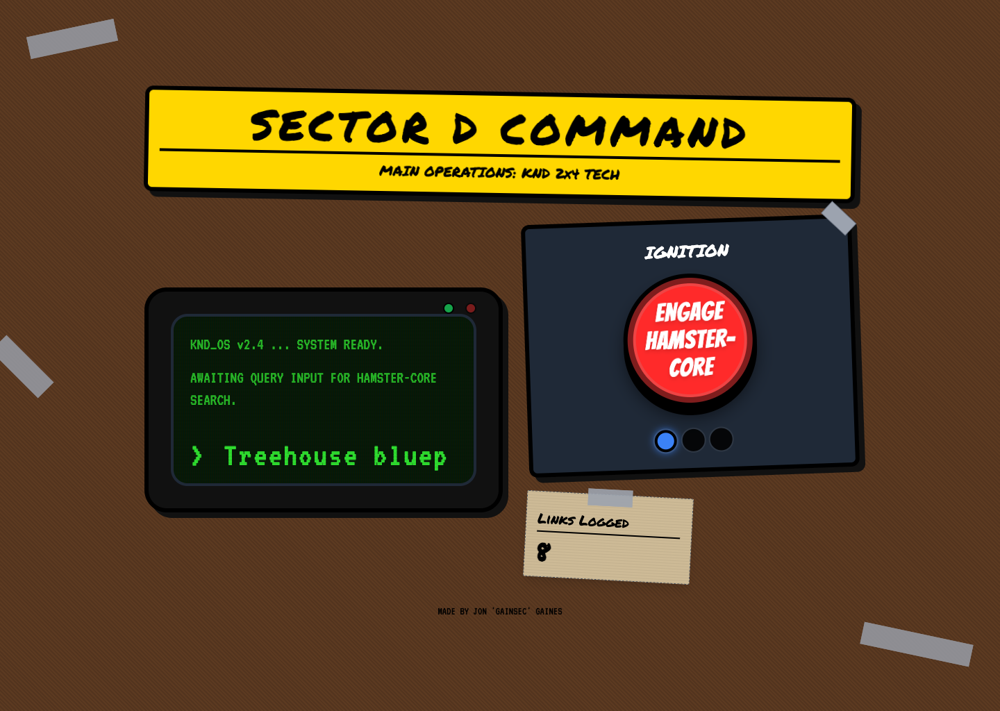
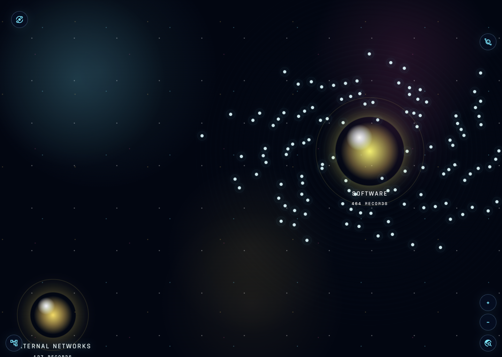
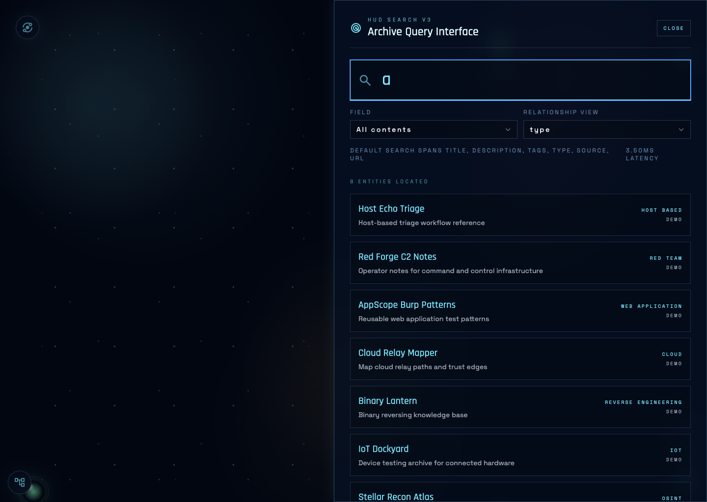
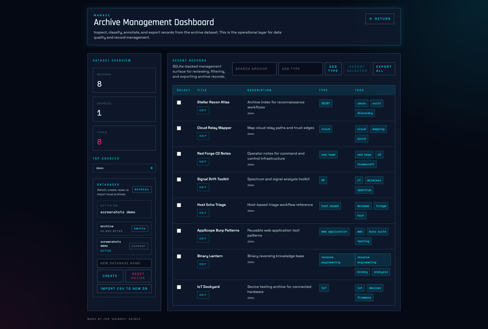
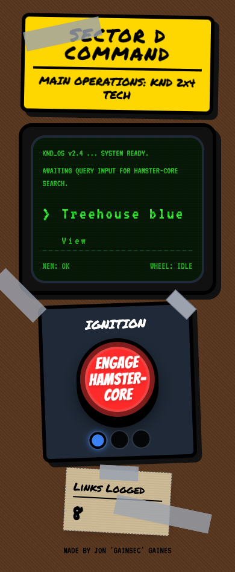
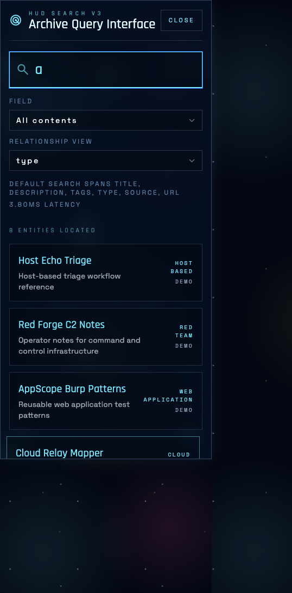

<p align="center">
  
</p>

SectorMap is a local-first archive browser for security datasets. This release bundle packages the **web app only**: the cinematic `Main Operations` / `Galaxy View` interface, the `Manage` dashboard, SQLite-backed search, export, and multi-database management.

This bundle does **not** include the iOS app and does **not** ship with a live dataset.

The published web bundle is **runtime-offline**:

- no Tailwind CDN dependency
- no Google Fonts dependency
- no Google Material Symbols dependency
- all required CSS and font assets are bundled locally under `app/static/assets/`

## What’s Included

- FastAPI backend with SQLite + FTS5
- Multi-database management in the web admin UI:
  - create empty database
  - switch active database
  - reset active database
  - import CSV into a new database
- Docker + Docker Compose support
- Example screenshots

## Directory Layout

```text
pub-release/
├── app/
│   ├── server.py
│   ├── static/
│   │   └── assets/
│   └── data/
├── scripts/
│   └── import_csv.py
├── docs/assets/
├── Dockerfile
├── docker-compose.yml
├── requirements.txt
└── README.md
```

## Requirements

- Python `3.11+` recommended
- SQLite support in the system Python build
- For containers: Docker `24+`
- Optional for rebuilding bundled CSS: Node.js `20+`

## Quick Start: Local Python

```bash
cd pub-release
python3 -m venv .venv
source .venv/bin/activate
pip install -r requirements.txt
uvicorn app.server:app --host 0.0.0.0 --port 3737
```

Open:

- `http://127.0.0.1:3737/`
- `http://127.0.0.1:3737/galaxy`
- `http://127.0.0.1:3737/manage`

On first startup, SectorMap creates an empty default database automatically.

## Import a CSV or SectorMap Database

You can import through the web admin UI or from the CLI.

### Option 1: Admin UI

1. Open `Main Operations`
2. Select `Manage`
3. Open the `Archive Management Dashboard`
4. Use the database panel to import either:
   - a normalized CSV archive
   - a SQLite `.db` exported from another SectorMap instance

### Option 2: CLI

```bash
cd pub-release
source .venv/bin/activate
python scripts/import_csv.py /path/to/archive.csv --name "client archive" --activate
```

Expected CSV columns:

```text
title,url,type,candidate_types,tags,description,source
```

## Database Management

The web admin UI supports:

- `Create`: make a new empty database
- `Switch`: change the active database the app is using
- `Reset Active`: wipe the current database back to empty schema
- `Import CSV/DB to New DB`: create a new database from:
  - a normalized CSV upload
  - a SectorMap SQLite database file upload

Runtime state lives in the data directory:

- SQLite DB files: `*.db`
- active database pointer: `active_db.json`

## Docker

### Build locally

```bash
cd pub-release
docker build -t sectormap-web:latest .
```

### Run locally

```bash
docker run \
  --rm \
  -p 3737:3737 \
  -v "$(pwd)/data:/app/data" \
  sectormap-web:latest
```

Open:

- `http://127.0.0.1:3737/`

### Docker Compose

```bash
cd pub-release
cp .env.example .env
docker compose up --build
```

## Offline Asset Build

The release already includes compiled CSS and bundled fonts/icons, so end users do **not** need Node.js to run it.

If you change the HTML and want to rebuild the local CSS bundle:

```bash
cd pub-release
npm install
npm run build:css
```

That rebuilds:

- `app/static/assets/css/main-operations.css`
- `app/static/assets/css/galaxy-view.css`
- `app/static/assets/css/admin-dashboard.css`

## Environment Variables

- `PORT`
  Default: `3737`
- `SECTORMAP_DATA_DIR`
  Default in container: `/app/data`
- `SECTORMAP_STATIC_DIR`
  Default in container: `/app/app/static`
- `SECTORMAP_DEFAULT_DB`
  Default: `archive.db`
- `SECTORMAP_DEFAULT_CSV`
  Optional path to a seed CSV. If missing, SectorMap starts with an empty DB.

## Screenshots

These screenshots use either a small demo database or a locally imported full archive created only for documentation. The public release does not ship those datasets.

Desktop: Main Operations



Desktop: Galaxy View



Desktop: Galaxy Search Overlay



Desktop: Admin Dashboard



Mobile Web: Main Operations



Mobile Web: Galaxy Search



## Notes

- No live dataset is included in this release.
- The app is designed for local/private deployment first.
- The web app stores its runtime data in SQLite; back up the `data/` directory if the databases matter.

## Web Release Only

This release bundle is intentionally scoped to the deployable web app. The native iOS project is not included here.
